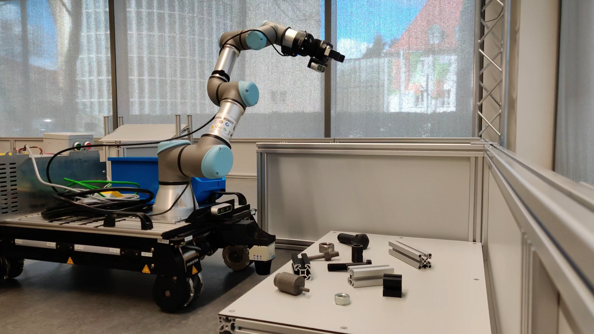

# Manipulation package with behavior trees


## Requierments and supported platforms
### Supported platforms/releases:

|Platform|ROS Release|
|-|------|
|[Ubuntu 18.04](https://releases.ubuntu.com/18.04/)|[ROS Melodic](http://wiki.ros.org/melodic/Installation)|

In case it is desired to migrate from ROS Melodic to ROS noetic or any ROS 2 distrutios please refer to the [migration guide](http://wiki.ros.org/melodic/Installation) from the behavior tree framework developers site. Keep in mind that most changes are incremental and back compatible with this repository.
### Requirements: 

You should have the swot package which can be downloaded from the [gitlab](https://gitlab.vlab.fm.fhws.de/swot/swot_platform/-/tree/main/), the [behavior tree package](https://github.com/BehaviorTree/BehaviorTree.CPP/tree/v3.8), and [c++ 17 or a newer version](https://en.cppreference.com/w/cpp/17) installed on your device. 

## Documentation and Enviornment setup
For guidance on installation, development, environmental setup, and troubleshooting, see the section "[Implementation](https://www.overleaf.com/read/ffcfzsjkwfws)" in Joel's bachelor thesis. This documentation includes a description of the sensors and the robot arm which were used to develop and test the behavior trees. A brief description of every node can found inside the respective folders. In case you desired to read a more detail explanation of every node please refer to the sub-section "Implemenation concept".

## Current features
- The [behavior tree](/src/swot_manipulation_bt) which replicates the old manipulation workflow. It is important to note that instead of the multiple go-to statements the old script had, this script allows the user to addapt the code in very easy manner through the usage of classes.

## Installation of this package
**1.** Go to the source folder of your catkin workspace.
```bash 
cd ~/catkin_ws/src
git clone https://github.com/Jasv06/swot_manipulation_bt.git
cd ~/catkin_ws
catkin_make
```
**2.** Source your current catkin workspace (Optional)
```bash 
source ~/catkin_ws/devel/setup.bash
```
## Running the behavior trees
If you didn't add `source $YOUR_WORKSPACE/devel/setup.bash` and `source /opt/ros/noetic/setup.bash` to your `.bashrc`, remember to source it when you open a new terminal. Also, in the following example catkin_ws is the name of our workspace, but this could change depending on the name you gave to your workspace. Note that for the following example it is assumed that you have the correct set up to operate the robot and have already downloaded the package from the swot gitlab containing everything needed.

### Example for picking
#### 1. Start the ROS master
Connect your computer to the Nvidia jetson by opening a terminal and typing: 
```sh
ssh nvidia@192.168.0.22
```
You will be required for a password. The password is:
```sh
nvidia
```
Finally start the ROS master: 
```sh
roscore
```
#### 2. Start the KoPro UR driver
Start in your computer the UR driver by launching the following:
```sh
roslaunch ur_ros_driver ur_full_driver.launch
```
#### 3. Start the azure kinect
The azure kinect can be started either in your computer or the onboard via: 
```sh
roslaunch swot_launch swot_k4a.launch
```
#### 4. Start YOLO
Yolo can be started in your computer, but it is highly recommended to start it in the YOLO Jetson. The first step is to switch to the YOLO Jetson by opening a new terminal and typing the following:
```sh
ssh irobot@192.168.0.6
```
Enter the following password:
```sh
myrobot
```
Start yolo by typing: 
```sh
roslaunch darknet_ros robocup_old_objects.launch
```
#### 5. Starting the necessary ROS service for object matching
Either in your computer or the onboard computer launch the following ROS service: 
```sh
roslaunch swo_object_matching ObjectMatching.launch
```
#### 6. Start the manipulation of the robot
Finally, open one last terminal, and type the following:
```sh
roslaunch swot_manipulation_bt swot_manipulation_bt
``` 
Or
```sh
roslaunch swot_manipulation_bt swot_manipulation_bt_enhanced
``` 
### Example Video
If all the previous steps were followed correclty and carefully you should be able to see the following. (Click on the image below)

[](https://youtu.be/qMAvnAv7Lg0)
