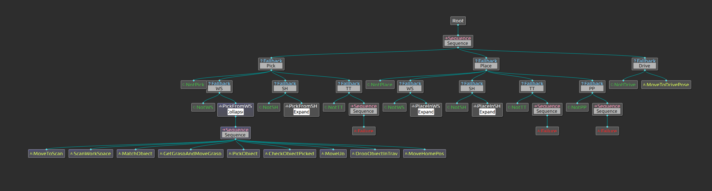

# Manipulation package with behavior trees



## Requierments and supported platforms
### Supported platforms/releases:

|Platform|ROS Release|
|-|------|
|[Ubuntu 18.04](https://releases.ubuntu.com/18.04/)|[ROS Melodic](http://wiki.ros.org/melodic/Installation)|

In case it is desired to migrate from ROS Melodic to ROS noetic or any ROS 2 distrutios please refer to the [migration guide](http://wiki.ros.org/melodic/Installation) from the behavior tree framework developers site. Keep in mind that most changes are incremental and back compatible with this repository.
### Requirements: 

You should have the swot package which can be downloaded from the [gitlab](https://gitlab.vlab.fm.fhws.de/swot/swot_platform/-/tree/main/), the [behavior tree package](https://github.com/BehaviorTree/BehaviorTree.CPP/tree/v3.8), and [c++ 14 or a newer version](https://en.cppreference.com/w/cpp/14) installed on your device. 

## Documentation and Enviornment setup
For guidance on installation, development, environmental setup, and troubleshooting, see the section "[Implementation](https://www.overleaf.com/read/ffcfzsjkwfws)" in Joel's bachelor thesis. This documentation includes a description of the sensors and the robot arm which were used to develop and test the behavior trees. A brief description of every node can found inside the respective folders. In case you desired to read a more detail explanation of every node please refer to the sub-section "Implemenation concept".

## Current features
- The [behavior tree](/src/swot_manipulation_bt) which replicates the old manipulation workflow. It is important to note that instead of the multiple go-to statements the old script had, this script allows the user to addapt the code in very easy manner through the usage of classes.
- The [behavior tree enhanced](/src/swot_manipulation_bt_enhanced) which contains additional capabilities through decorator nodes which expand the behavior tree framework through my own criteria.

## Installation of this package
**1.** Go to the source folder of your catkin workspace.
```bash 
cd ~/catkin_ws/src
git clone https://github.com/Jasv06/swot_manipulation_bt.git
cd ~/catkin_ws
catkin_make
```
**2.** Source your current catkin workspace (Optional)
```bash 
source ~/catkin_ws/devel/setup.bash
```
## Running the behavior trees
If you didn't add `source $YOUR_WORKSPACE/devel/setup.bash` and `source /opt/ros/noetic/setup.bash` to your `.bashrc`, remember to source it when you open a new terminal. Also, in the following example catkin_ws is the name of our workspace, but this could change depending on the name you gave to your workspace.

### Example
#### Connecting the Leap motion sensor
1. Open a terminal and type:
```sh
sudo leapd
```
#### Use the Leap Motion sensor
2. Open a terminal, source it and type the following:
```sh
cd ~/catkin_ws/src/human_robot_interaction/scripts/Industrial_like_robot
python2 Leap_client_industrial.py
```
#### Publishing the data extracted from the Leap motion sensor into ROS
3. Open a new terminal, source it and type the following:
```sh
cd ~/catkin_ws
roslaunch human_robot_interaction leap_ros_industrial.launch
```
#### Connecting to the Robot
4. Ensure the Robot is connected correctly, open a new terminal, source it and type the following:
```sh
cd ~/catkin_ws
roslaunch interbotix_xsarm_control xsarm_control.launch robot_model:=rx150 
```
#### Controlling the robot
5. Finally, open one last terminal, source it and type the following:
```sh
cd ~/catkin_ws
rosrun human_robot_interaction robot_control_industrial_3.py
``` 
### Example Video
If all the previous steps were followed correclty and carefully you should be able to see the following.

[]()
